Provide Liquidity on Value Liquid - Written by yfvfinance.rocks

---

**Value Liquid allows users to provide liquidity to the Value Liquid Exchange. Liquidity providers get a share of the fees when someone makes a trade against the token you have provided liquidity for.**

When you provide Liquidity on Value Liquid you will receive VLP tokens. Additionally, you can then use your VLP tokens to farm for Value Rewards.

**Lets provide some liquidity and get Value Liquidity Pool (VLP) Tokens**

1. Go to https://valuedefi.io/ and select the pool you want to farm in:

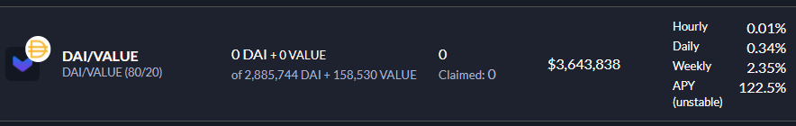

For this tutorial i’m going to provide Liquidity for DAI/Value, for this I will receive VLP tokens. I can also use these tokens to farm Value.

2. You’ll see an icon to create a VLT for your selected pool. Click this to go to Liquid to create the token.

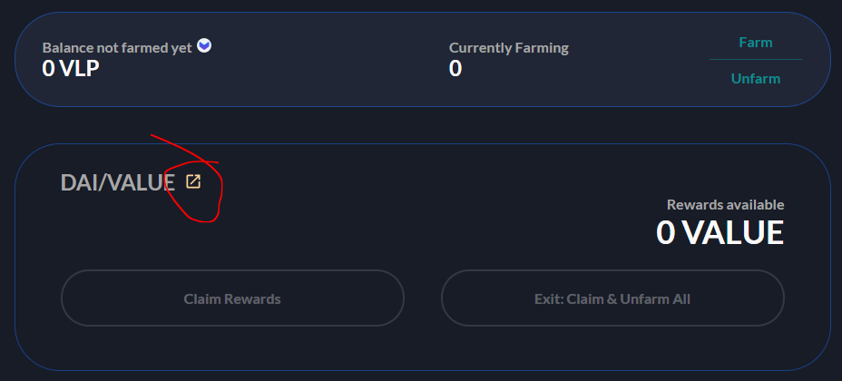

3. Value liquid will open with the appropriate pairs. The VALUE/DAI pair requires 80% DAI and 20% Value. Add the amount of DAI you want to use and then click ‘Setup Proxy’.

**Note:** _Steps 3-7 are only required if your wallet has never provided liquidity before. If you have already set up the proxy skip to step 8. The proxy will allow farmers to use the new Liquid technology for flexible farming when the full roadmap is released._

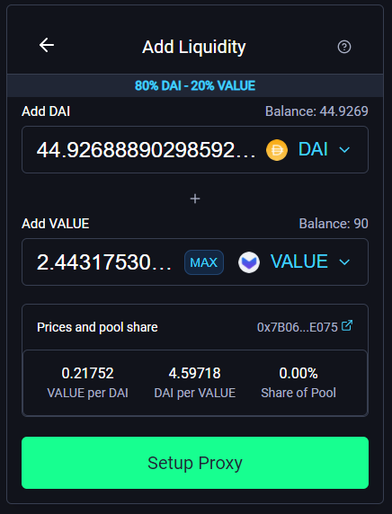

4. After clicking ‘Setup Proxy’ you’ll see the final confirmation screen, click the ‘Setup’ button as you’ll see below:

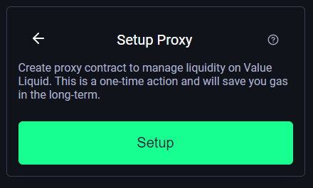

5.Confirm the transaction in your wallet

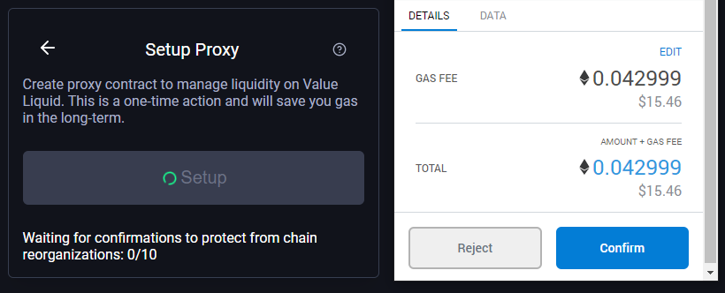

6. When all 10 transactions have been completed you’ll see the following screen:

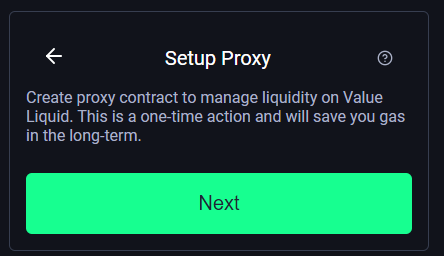

7. Now you’ve set up the proxy, add the amount of liquidity you want to provide.

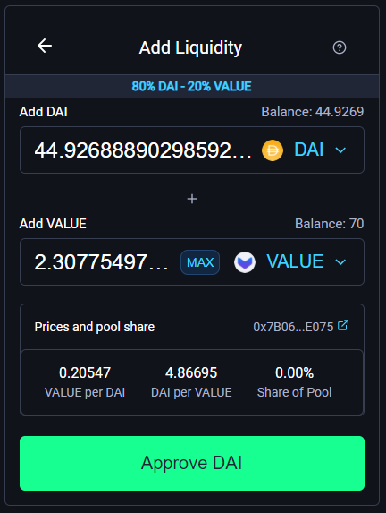

8. Approve your DAI spend. Click confirm in your metamask wallet to confirm this transaction.

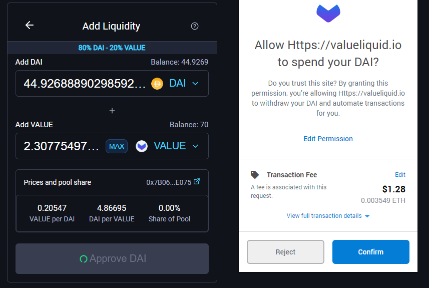

9. Now approve your Value, click the approve Value button

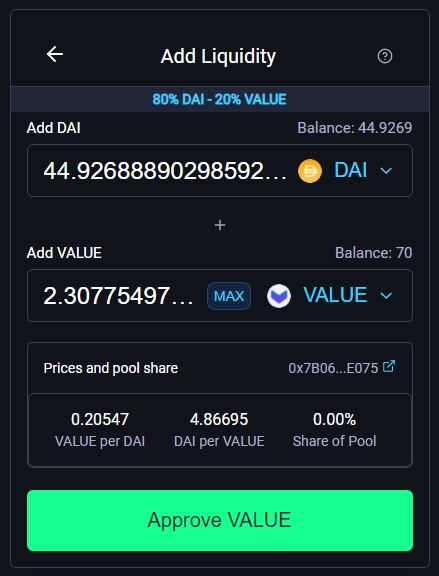

10. You’ll have to confirm this transaction in your metamask wallet. Click confirm.

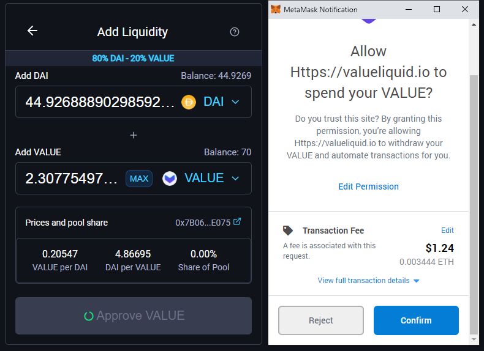

11. When the transaction has confirmed, click ‘Supply’

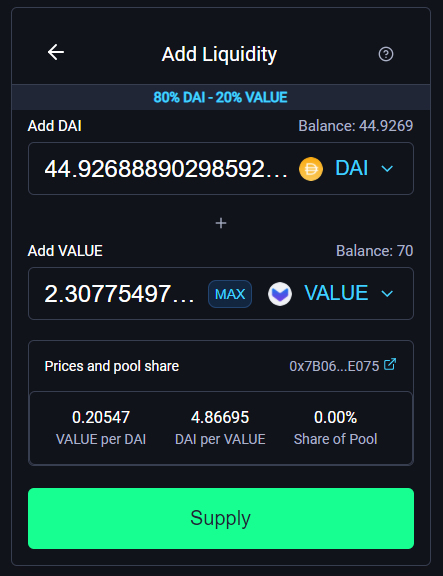

12. You’ll get a final pop-up confirmation screen as below, click ‘Confirm Supply’:

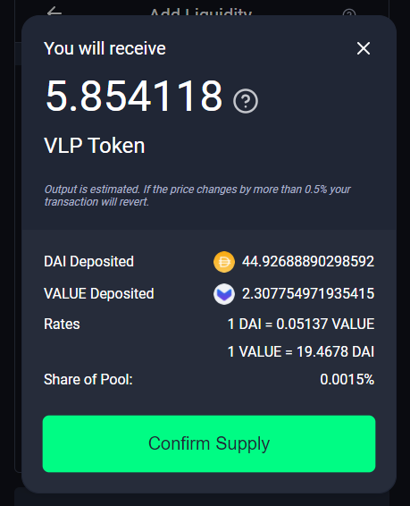

13. Confirm the transaction in your wallet:

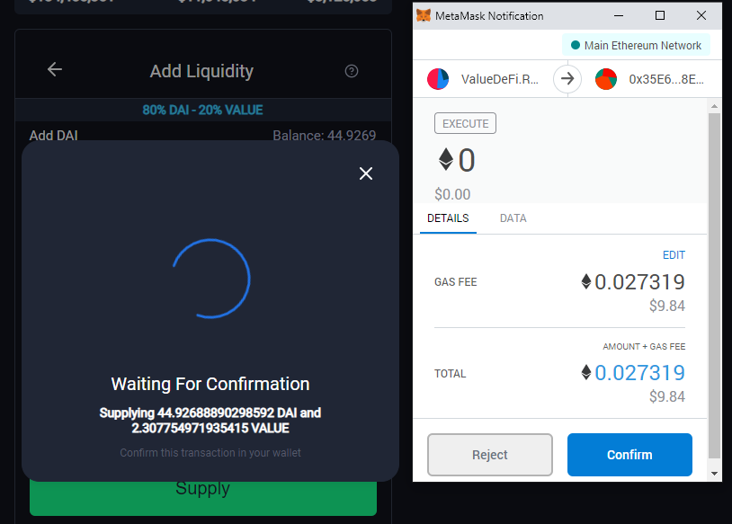

14. Thats it….once your transaction is confirmed, if you refresh the page, at the bottom you should see the liquidity you have provided and the number of VLPs received.:

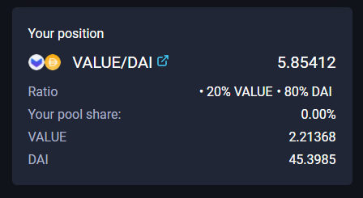

I’ve received 5.85 VLP tokens for the Value/DAI pool

**See your VLP tokens in your Metamask wallet:**

I’ve created a VLP token for the Value/Dai pair, I now need to add the contract address to Metamask so I can see them in my wallet.

1. Click the link shown below to get the contract address:

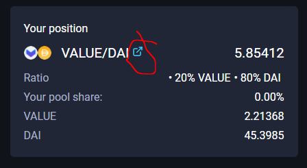

2. This will bring you to the contract address for the Value/Dai VLP pair token. Select the copy button.

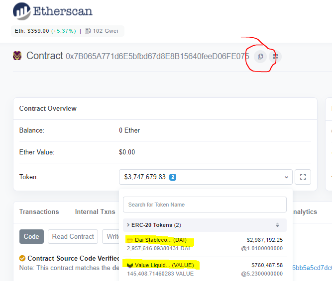

Click the icon to copy the contract address for your VLP token.

3. Add the token address to your Metamask wallet and click next.

(See our full guide for [adding tokens to Metamask](https://yfvalue.rocks/what-is-staking/add-a-token-to-your-metamask-wallet/)).

I’ve also edited the token symbol to include DAI/VAL so I can distinguish from my other VLPs

4. Metamask has found my tokens, confirm to add them to your wallet.

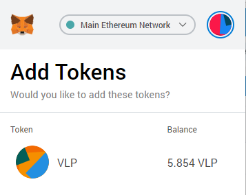
