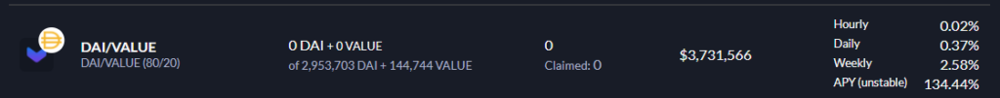
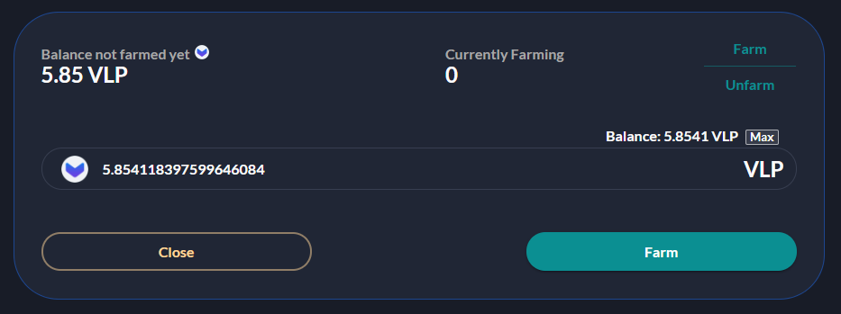
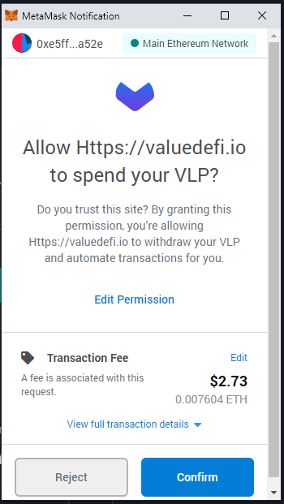
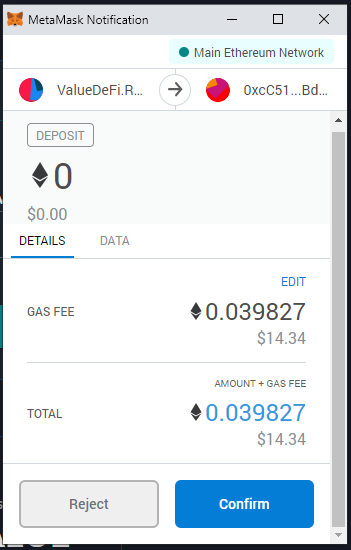
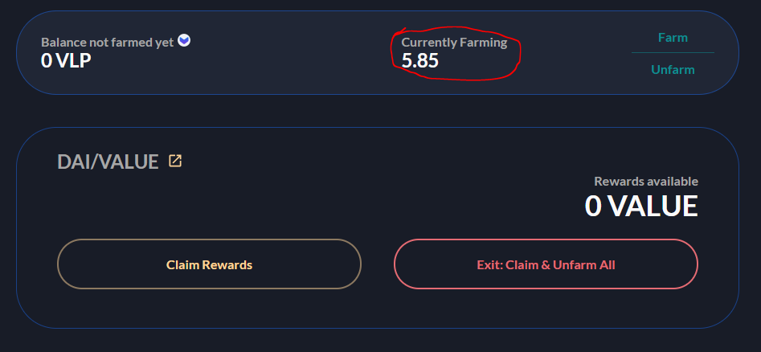

Farm the Value Token rewards at Value Pools - Written by yfvfinance.rocks

---

[Follow the first steps at 'Provide Liquidity on Value Liquid'](./G2)  
After this, proceed to use your VLP tokens to farm VALUE.

So now we’re providing liquidity and LP fees we can also use these VLP tokens to farm Value.

**Lets use these VLP tokens to farm for Value**

1. Find the pool you want to farm at https://valuedefi.io/
2. I have DAI/VALUE tokens so ill go click on that pool.

3. Click on the farm button and enter the amount you want to farm

4. Confirm the transaction in your metamask wallet:

5. Confirm in your wallet

6. Thats it. Now i’m collecting rewards on my VLP tokens.

Now you try – Select your pool at https://valuedefi.io/
